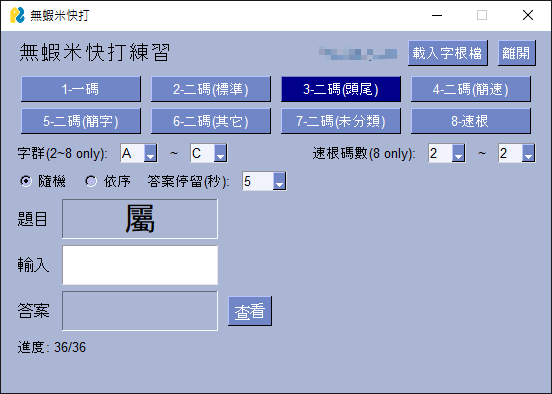

# 無蝦米快打練習

使用 Python + PySimpleGUI 開發的無蝦米輸入法打字練習工具。



## 執行
```
python main.pyw
```
（`.pyw` 副檔名不會出現命令視窗，直接雙擊即可）

**首次使用必須自行載入 `.cin` 字根檔**（無內建字根）。啟動時若尚未指定有效的字根檔，會彈出檔案視窗請你選取，載入成功後才開始練習。

## 資源
+ 字根檔：由使用者自行載入 `.cin` 檔（程式不附預設字根），參見下方「字根檔」
+ 二碼字分類：參考 https://boshiamy.then.tw/two-keys 的色彩分類
+ 連根表（簡速字根表）：參考 https://boshiamy.then.tw/shorthand

## 檔名結構
| 檔案 | 說明 |
|------|------|
| `main.pyw` | 主程式 |
| `*.cin` | 使用者自行載入的字根檔（不在本專案內） |
| `two_key_classification.py` | 二碼字 6 類分類資料 |
| `shorthand_roots.py` | 連根表資料（排除無法顯示的 PUA 字） |
| `settings.json` | 自動儲存的上次設定（含字根檔路徑） |

## 練習模式
| 按鍵 | 模式 | 說明 |
|------|------|------|
| 1 | 一碼 | a~z 一碼字 |
| 2 | 二碼(標準) | 來自標準字根 |
| 3 | 二碼(頭尾) | 來自頭尾碼 |
| 4 | 二碼(簡速) | 來自簡速字根 |
| 5 | 二碼(簡字) | 來自簡體字 |
| 6 | 二碼(其它) | 其它 |
| 7 | 二碼(未分類) | 網站未分類的字 |
| 8 | 連根 | 以簡速字根組成的字 |

## 功能
### 字根檔
+ 執行期間按 **載入字根檔** 按鈕可更換 `.cin` 檔，更換後立即以新字根檔重新出題
+ 標題列會顯示目前使用的字根檔檔名
+ 啟動時自動載入上次使用的字根檔；若路徑不存在則重新請你選擇

### 過濾
+ **字群**（`A` ~ `Z` 兩個下拉）：只練習範圍內字母的字，一碼/二碼/連根皆適用
  - `A~A` → 只練 A；`B~F` → B、C、D、E、F；`A~Z` → 全部
  - only for 2~8 項練習
+ **速根碼數**（`2` / `3` / `多` 兩個下拉）：只作用於**連根模式**，按 keystroke 長度過濾
  - `2~2` → 2碼；`2~3` → 2~3碼；`3~多` → 3碼以上
  - only for 8th項練習

### 出題
+ **隨機 / 依序** radio：隨機出題 / 依 keystroke 字母順序出題
+ 切換模式、字群、碼數、隨機/依序都會重新出題

### 作答
+ 直接鍵入 keystroke，**空白鍵送出**
+ `Backspace` 刪除最後一字
+ **查看**按鈕顯示答案（大寫）

### 計分流程
+ 答對：從題庫移除
+ 答錯：顯示 `錯了 (n/3)`，**字仍留在題庫繼續練習**（依序模式會重複出同一題）
+ 錯三次：顯示答案，停留可設定 **1~10 秒**（預設 2 秒）後進下一題
+ 全部答對：顯示 `這一組練完了! 花費 X分Y秒`
+ 完成後按 **空白鍵** 重新練習同一組

## 設定
+ 關閉程式或按**離開**時自動儲存 `settings.json`
+ 下次開啟自動載入上次的模式、字群、碼數、隨機/依序、字根檔路徑、答案停留秒數
+ 字根檔路徑失效時（檔案被移除）會重新跳出選擇視窗